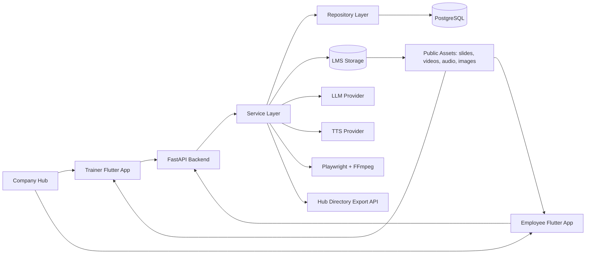
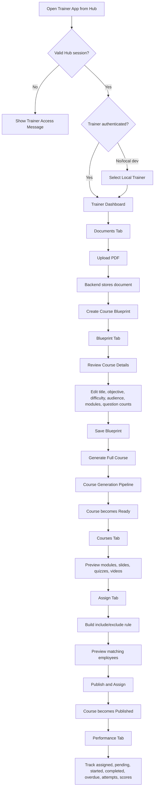
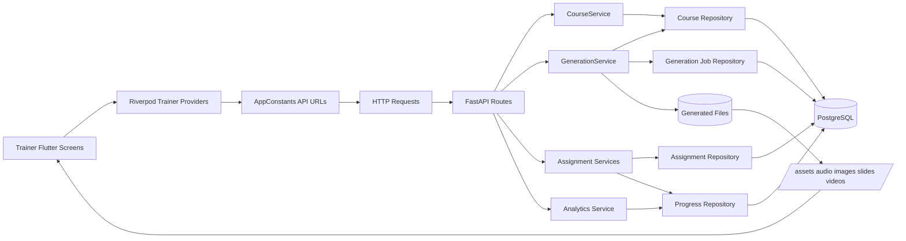
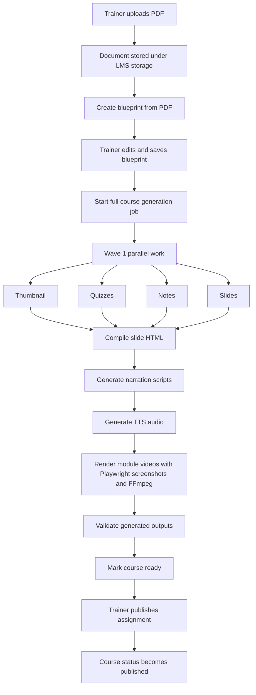
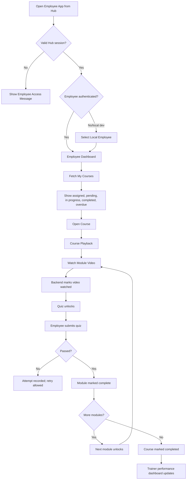
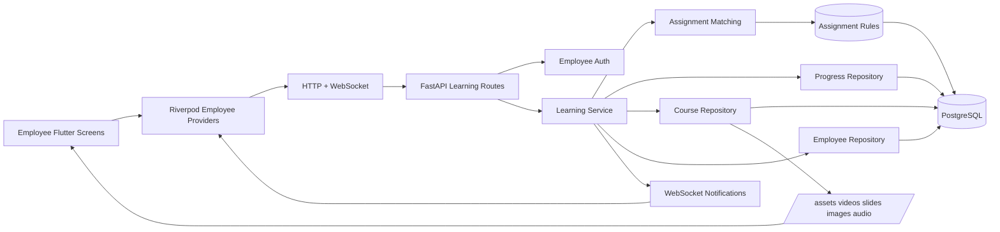
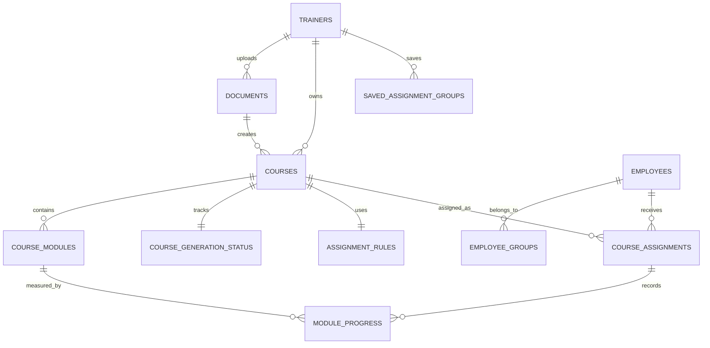
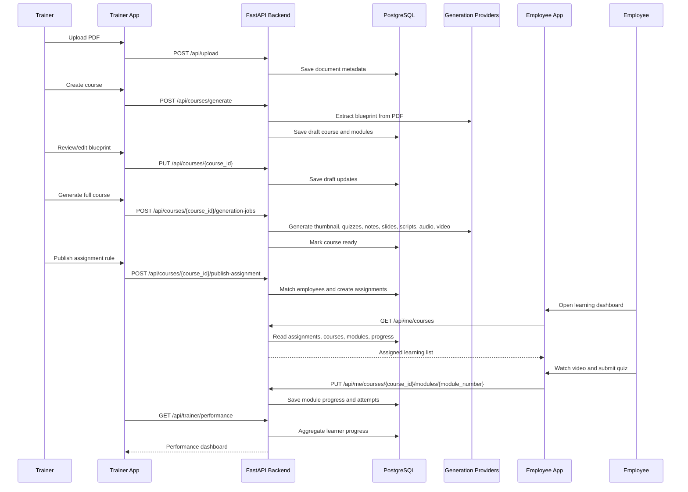

# Learning Management System

An internal LMS for turning uploaded training PDFs into structured courses with
trainer authoring tools, employee learning views, quizzes, generated slide decks,
narration audio, and module videos.

## Project Structure

```text
backend/             FastAPI API, generation pipeline, PostgreSQL-backed storage
frontend/            Flutter trainer/admin web app
employee_frontend/   Flutter employee learning web app
```

The backend owns course generation and persistence. The trainer frontend uploads
documents, manages courses, assigns training, and reviews performance. The
employee frontend lets learners view assigned courses, watch module videos, and
complete quiz/progress flows.

## Product Flow and Architecture

This system has two user-facing apps that share one backend:

```text
Trainer app   Used by trainers/admins to create, review, generate, assign, and
              monitor courses.
Employee app  Used by employees to see their assigned learning, watch lessons,
              complete quizzes, and track completion.
Backend       Owns authentication, course generation, assignment rules,
              employee directory sync, progress tracking, reporting, and files.
```

At a high level, trainers turn source documents into published courses. Employees
only see courses that have been fully generated, published, and assigned to them.



### Non-Technical System Summary

The LMS is best understood as a shared course factory plus two different
workspaces:

1. A trainer uploads a PDF training document.
2. The backend reads that PDF and creates an editable course blueprint.
3. The trainer reviews the blueprint, adjusts modules/questions if needed, and
   starts full course generation.
4. The backend generates supporting learning material: thumbnail, notes, quiz
   questions, slides, narration scripts, audio, and videos.
5. When the generated course is complete, the trainer publishes assignment rules.
6. The backend matches those rules against synced Hub employees and creates
   employee course assignments.
7. Employees open the employee app, see only courses assigned to them, watch
   module videos, complete quizzes, and progress through the course.
8. Trainers use the performance view to monitor who is pending, started,
   completed, overdue, and how employees performed on quizzes.

## Trainer App Flow

The trainer app lives in `frontend/`. It is a Flutter web app using Riverpod
state providers. Its main screen is a tabbed dashboard:

```text
Documents -> Blueprint -> Courses -> Assign -> Performance
```

Trainer access is checked first through Hub launch/session endpoints. In local
development, the app can also show a trainer picker based on synced employees.



### Trainer Screens

| Trainer area | Main purpose | Backend data used |
| --- | --- | --- |
| Hub gate | Confirms the trainer opened the app through Hub or local dev mode | `/api/hub/session/trainer`, `/api/auth/local/trainers`, `/api/auth/local/trainer-login` |
| Documents | Upload PDFs and preview stored documents | `/api/upload`, `/api/files`, `/api/files/{file_name}/preview` |
| Blueprint | Turn an uploaded document into an editable course outline | `/api/courses/generate`, `/api/courses`, `/api/courses/{course_id}` |
| Courses | Review generated course details, modules, slides, quizzes, and videos | `/api/courses`, `/api/courses/{course_id}`, `/assets/...` |
| Generation portals | Generate quizzes, slides, narration scripts, and videos manually or as a full job | `/api/courses/{course_id}/generate-*`, `/api/courses/{course_id}/generation-jobs` |
| Assign | Define who should receive a course and publish assignment rules | `/api/assignment/options`, `/api/assignment/saved-groups`, `/api/courses/{course_id}/assignment`, `/api/courses/{course_id}/publish-assignment` |
| Performance | Filter and inspect learner status, module completion, quiz attempts, and scores | `/api/trainer/performance` |

### Performance reporting

The trainer Performance tab has Overview, Courses, and Learners views. New
reporting endpoints under `/api/trainer/performance/` serve the overview,
filter options, course summaries and detail, database-paginated assignments and detail,
and CSV export. The older `/api/trainer/performance` response remains available
for existing consumers, and `/api/employee/team-performance` remains scoped to
an employee's direct reports.

The reporting unit is an active employee-course assignment. Completion rate is
completed assignments divided by active assignments. Due soon means an
incomplete assignment due within `EMAIL_DUE_SOON_DAYS`; overdue means an
incomplete assignment past its deadline. On-time compliance divides assignments
completed by their deadline by assignments whose deadlines have passed.
Average score uses the latest scored result for each attempted module and
includes the scored-module count; reports display quiz scores as percentages.
Mailing-list groups can overlap because an
employee may belong to more than one list.

`last_learner_activity_at` is updated by learner progress requests, separately
from administrative assignment changes. Quiz attempts and video-watched events
are recorded in `learning_events` from the reporting upgrade onward. Earlier
individual attempts cannot be reconstructed; the assignment detail labels this
limit. The completion trend uses assignment completion dates, including dates
recorded before the upgrade.

#### Local Performance demo

Use a separate PostgreSQL database named `lms_performance_demo`; do not point
the seed script at the normal `lms` database. Set `DATABASE_URL` to that demo
database and `HUB_LAUNCH_DEV_MODE=true`, then run from `backend`:

```powershell
.\.venv\Scripts\python.exe -m scripts.seed_performance_demo
.\.venv\Scripts\python.exe -m uvicorn app.main:app --host 127.0.0.1 --port 3061
```

The seed is synthetic and guarded to run only against the named demo database.
It creates one local trainer identity, 100 learners, four courses, and 400
assignments with varied completion, overdue, quiz, and activity states. It
will not overwrite an existing demo. For the trainer frontend, set its
ignored `.env` to `API_BASE_URL=http://127.0.0.1:3061`, allow the frontend
origin in `CORS_ALLOWED_ORIGINS`, and open the app as *Performance Demo Trainer*.

### Trainer Architecture



### Trainer Course Creation Pipeline



Generation is checkpointed. If a stage fails, the backend records the failed
checkpoint and the trainer can continue generation instead of starting the whole
course from the beginning.

## Employee App Flow

The employee app lives in `employee_frontend/`. It is a Flutter web app focused
on learning, not authoring. Employees see a dashboard, their course library,
notifications, and the course playback workspace.

Employee access also starts through Hub. In local development, the app can show
an employee picker so the learning flow can be tested without Hub.



### Employee Screens

| Employee area | Main purpose | Backend data used |
| --- | --- | --- |
| Hub gate | Confirms the employee opened the app through Hub or local dev mode | `/api/hub/session/employee`, `/api/auth/local/employee-login` |
| Employee dashboard | Shows learning metrics, assigned work, due dates, and status filters | `/api/me/courses` |
| My Courses | Lists all assigned/published courses for the current employee | `/api/me/courses` |
| Notifications | Highlights newly assigned courses in the current session | `/api/me/courses`, `/api/me/courses/ws` |
| Course playback | Plays module videos, shows notes, handles quiz answers, and locks/unlocks modules | `/api/me/courses/{course_id}/modules/{module_number}`, `/assets/videos/...` |
| Progress sync | Updates watched videos, quiz scores, selected answers, attempts, and completion | `/api/me/courses/{course_id}/status`, `/api/me/courses/{course_id}/modules/{module_number}` |

### Employee Architecture



### Employee Learning Rules

```text
1. Employees only receive courses that are published and whose active assignment
   rule matches their employee record.
2. Assignment rules can include everyone or selected groups, then exclude
   employees/groups/departments/mailing lists.
3. The first module is available immediately.
4. A module quiz unlocks only after the module video is watched.
5. The next module unlocks after the previous module is complete.
6. A module is complete when the video is watched and, if a quiz exists, the
   quiz is passed.
7. A course is complete when every published module is complete.
8. Progress changes are written to PostgreSQL and broadcast back to the employee
   app over WebSocket so the dashboard stays fresh.
```

## Shared Backend Data Model

The backend stores structured data in PostgreSQL and generated files in LMS
storage. The important tables are:

| Table | What it represents |
| --- | --- |
| `trainers` | Trainer identities synced from Hub/local development |
| `employees` | Employee identities, departments, job titles, Hub IDs, and status |
| `employee_groups` | Mailing-list or AD group membership from Hub directory sync |
| `directory_sync_state` | Cursor/status for full and incremental Hub directory sync |
| `documents` | Uploaded PDFs owned by a trainer |
| `courses` | Course-level metadata, lifecycle status, thumbnail, and trainer owner |
| `course_modules` | Module text, notes, slide JSON, quiz JSON, generated video path |
| `course_generation_status` | Checkpoints, stage status, failures, worker lock state |
| `assignment_rules` | Include/exclude filters, deadlines, active/published flags |
| `saved_assignment_groups` | Reusable include/exclude filter groups saved by trainers |
| `course_assignments` | One assigned course per employee, with status and due date |
| `module_progress` | Per-module watched/quiz state, attempts, scores, selected answers |



## End-to-End Lifecycle



## Backend

Runtime entrypoint:

```powershell
cd backend
.\.venv\Scripts\python.exe -m uvicorn app.main:app --reload
```

Install dependencies from a clean environment:

```powershell
cd backend
python -m venv .venv
.\.venv\Scripts\Activate.ps1
python -m pip install -r requirements.txt
python -m playwright install chromium
```

Important backend paths:

```text
backend/app/api/          HTTP routes
backend/app/services/     business workflows
backend/app/repositories/ PostgreSQL persistence layer
backend/app/generation/   course generation stages
backend/app/templates/    slide HTML/CSS templates
backend/app/static/       public brand assets
backend/scripts/          generation subprocess entrypoint
backend/storage/          uploads and generated media
```

The generation job manager currently launches one course pipeline through:

```powershell
.\.venv\Scripts\python.exe -m scripts.run_pipeline --course-id <course_id>
```

Do not remove `backend/scripts/run_pipeline.py` while the current job manager is
still in use.

## Docker Deployment

The root Compose stack is the deployment shape for the current app:

```text
backend            FastAPI API and generation pipeline
frontend           trainer/admin Flutter web app
employee_frontend  employee Flutter web app
```

PostgreSQL is controlled by the `COMPOSE_PROFILES` environment setting:

```text
COMPOSE_PROFILES=bundled-db   run the bundled Postgres container for VM/test
COMPOSE_PROFILES=             do not run Postgres; use company DATABASE_URL
```

The command stays the same in both modes:

```bash
docker compose up -d --build
```

Create host persistence directories on the VM:

```bash
sudo mkdir -p /opt/lms/postgres /opt/lms/storage /opt/lms/backups
```

Create the deployment env file:

```bash
cp .env.example .env
nano .env
```

Set real secrets and VM/domain origins in `.env`, especially:

```text
COMPOSE_PROFILES
DATABASE_URL
POSTGRES_PASSWORD
CORS_ALLOWED_ORIGINS
LLM_BASE_URL
LLM_API_KEY
TTS_ENDPOINT
COURSE_THUMBNAIL_ENDPOINT
HUB_LAUNCH_SECRET
DIRECTORY_EXPORTS_API_KEY
DIRECTORY_SYNC_ADMIN_KEY
```

For the current VM/test deployment with bundled Postgres:

```env
COMPOSE_PROFILES=bundled-db
DATABASE_URL=postgresql://lms:<password>@postgres:5432/lms
POSTGRES_DB=lms
POSTGRES_USER=lms
POSTGRES_PASSWORD=<password>
```

For on-prem/company Postgres:

```env
COMPOSE_PROFILES=
DATABASE_URL=postgresql://lms_user:<password>@company-postgres-host:5432/lms_db
```

Start or update the deployment:

```bash
docker compose up -d --build
```

Default deployed ports match the existing VM branch:

```text
Backend health:   http://<vm-host>:3060/health
Trainer app:      http://<vm-host>:6969
Employee app:     http://<vm-host>:6970
```

Port map:

```text
3060 -> backend container port 8000
6969 -> trainer frontend container port 80
6970 -> employee frontend container port 80
127.0.0.1:5432 -> bundled postgres container port 5432, only when COMPOSE_PROFILES=bundled-db
```

When bundled Postgres is enabled, it is bound to `127.0.0.1` on the VM host,
not to the public network interface. This keeps the database reachable for
host-local maintenance while preventing direct external access to the database
port. Backend-to-database traffic inside Docker uses the private service name
`postgres:5432`.

When `COMPOSE_PROFILES` is empty for on-prem/company deployments, this Compose
stack does not start PostgreSQL. Backend-to-database traffic uses the company
database endpoint provided in `DATABASE_URL`.

Compose persists data in explicit host folders:

```text
/opt/lms/postgres    bundled PostgreSQL rows, only when COMPOSE_PROFILES=bundled-db
/opt/lms/storage     uploads and generated audio/images/slides/videos
/opt/lms/backups     backup output location
```

Rebuilding containers does not erase those host folders. Do not delete them
unless you intentionally want to reset production data.

Check status and logs:

```bash
docker compose ps
docker compose logs -f backend
```

Back up PostgreSQL and storage on the VM/test bundled deployment:

```bash
stamp=$(date +%Y%m%d_%H%M%S)
docker compose exec -T postgres pg_dump -U "$POSTGRES_USER" "$POSTGRES_DB" > "/opt/lms/backups/lms_${stamp}.sql"
tar -czf "/opt/lms/backups/storage_${stamp}.tar.gz" -C /opt/lms storage
```

For on-prem/company PostgreSQL, use the company database backup process or run
`pg_dump "$DATABASE_URL"` from an approved admin host.

Stop services without deleting data:

```bash
docker compose stop
```

Do not remove `/opt/lms/storage` unless you intentionally want to erase
uploaded/generated LMS files. For VM/test deployments using
`COMPOSE_PROFILES=bundled-db`, also do not remove `/opt/lms/postgres` unless you
intentionally want to erase the bundled test database.

## Frontends

Trainer app:

```powershell
cd frontend
flutter pub get
flutter run -d chrome
```

Employee app:

```powershell
cd employee_frontend
flutter pub get
flutter run -d chrome
```

Both Flutter apps read `API_BASE_URL` through `flutter_dotenv`. In local
development they fall back to:

```text
http://localhost:8000
```

That `8000` port is for direct terminal development only, for example when the
backend is started with `uvicorn app.main:app --reload --port 8000`. Docker/VM
deployment exposes the backend on host port `3060`.

For the Docker deployment, frontend builds use same-origin `/api` and `/assets`
through nginx, so no VM-specific backend URL is baked into the Flutter build.

## Environment

For Docker deployment, copy the root `.env.example` to `.env` and set real
values. The root template is the only committed env template. Direct terminal
runs may still use private local env files such as `backend/.env`,
`frontend/.env`, and `employee_frontend/.env`.

Key settings:

```text
APP_ENV
LOG_LEVEL
CORS_ALLOWED_ORIGINS
DATABASE_URL
LLM_BASE_URL
LLM_API_KEY
LLM_MODEL_NAME
TTS_ENDPOINT
TTS_VOICE
COURSE_THUMBNAIL_ENDPOINT
COURSE_THUMBNAIL_API_KEY
GENERATION_MAX_CONCURRENCY
LMS_STORAGE_DIR
HUB_LAUNCH_SECRET
HUB_TRAINER_APP_KEY
HUB_EMPLOYEE_APP_KEY
HUB_LAUNCH_DEV_MODE
DIRECTORY_EXPORTS_BASE_URL
DIRECTORY_EXPORTS_API_KEY
DIRECTORY_SYNC_ADMIN_KEY
DIRECTORY_SYNC_ENABLED
DIRECTORY_SYNC_INTERVAL_HOURS
DIRECTORY_SYNC_TIME
DIRECTORY_SYNC_TIMEZONE
LANGFUSE_ENABLED
LANGFUSE_BASE_URL
LANGFUSE_HOST
LANGFUSE_PUBLIC_KEY
LANGFUSE_SECRET_KEY
LANGFUSE_ENVIRONMENT
LANGFUSE_RELEASE
LANGFUSE_CAPTURE_CONTENT
```

Generated uploads, audio, images, slides, and videos live under `/app/storage`
inside the backend container and `/opt/lms/storage` on the VM host. Structured
application data lives in PostgreSQL. SQLite is no longer supported.

## Langfuse LLM Observability

The backend can send course-generation traces directly to an existing
Langfuse server. Tracing is disabled by default and is fail-open: missing
credentials, SDK initialization problems, or delivery failures never stop LMS
course generation.

`LANGFUSE_BASE_URL` is the preferred Langfuse v4 setting. The older
`LANGFUSE_HOST` name remains supported as a backward-compatible alias.

```env
LANGFUSE_ENABLED=true
LANGFUSE_BASE_URL=http://<langfuse-host>:3100
LANGFUSE_PUBLIC_KEY=pk-lf-...
LANGFUSE_SECRET_KEY=sk-lf-...
LANGFUSE_ENVIRONMENT=uat
LANGFUSE_RELEASE=<deployed-git-commit>
LANGFUSE_CAPTURE_CONTENT=false
LANGFUSE_CAPTURE_MAX_CHARS=12000
LANGFUSE_TIMEOUT_SECONDS=5
```

Keep `LANGFUSE_CAPTURE_CONTENT=false` unless storage of LMS prompts and model
outputs has been approved. With content capture disabled, traces still include
course/job identifiers, stage and module metadata, model name, duration,
finish reason, status, and token usage returned by the LLM gateway.

Before enabling direct app-side tracing, confirm that the configured LiteLLM
gateway does not already send the same calls to Langfuse. Otherwise each LLM
request will appear twice. After deployment, generate one UAT course and verify
that it produces one top-level LMS trace with nested stage spans and one
generation for each real LLM HTTP attempt.

## Course Email Notifications

Course email is generated and delivered by the backend. Employee messages are
individual. HOD and trainer messages for due-soon, completed, and overdue
events are consolidated into authenticated, role-scoped digests. Assigned
course messages remain individual for the employee and HOD; the five-day
reminder is employee-only.

Set `LMS_EMPLOYEE_PUBLIC_URL` and `LMS_TRAINER_PUBLIC_URL` to the externally
reachable UAT URLs so course and report links open the correct application.
`LMS_PUBLIC_URL` remains a fallback for older deployments. Digest times use
`EMAIL_NOTIFICATION_TIMEZONE` and `EMAIL_DIGEST_SEND_TIME`. Due-soon and
completion digests default to every 24 hours; overdue employee messages and
HOD/trainer digests default to every 48 hours.

The outbox revalidates every assignment immediately before delivery. Completed,
revoked, unpublished, reassigned, or otherwise stale items are removed and an
empty digest is cancelled. On first startup after this migration, unsent legacy
HOD/trainer individual rows are converted to digest items; sent history is not
modified.

For safe UAT verification, begin with `EMAIL_DELIVERY_MODE=log`, inspect the
outbox and backend logs, then switch to `smtp` only after SMTP connectivity and
recipient data have been validated.

## Hub Directory Sync

The app imports real employees from the Hub directory export API. Department is
stored on `employees.department`. Mailing-list assignment filters use
`employee_groups.group_cn`, parsed from each AD group in the employee's group
list. `employee_groups.group_dn` keeps the full AD distinguished name for audit
and future use.

For the first clean production bootstrap, run a full employee import before
opening the app to users:

```bash
docker compose exec backend python -m scripts.sync_directory full
```

Then drain employee change logs once from `after_id=0` so the incremental cursor
starts from the current Hub state:

```bash
docker compose exec backend python -m scripts.sync_directory incremental --after-id 0
```

After bootstrap, keep `DIRECTORY_SYNC_ENABLED=true` for the backend container.
The scheduler runs incremental change-log sync once per calendar day at
`DIRECTORY_SYNC_TIME` in `DIRECTORY_SYNC_TIMEZONE`; production defaults are
`09:10` and `Asia/Kolkata`. `DIRECTORY_SYNC_INTERVAL_HOURS` is still accepted
for older env files, but daily scheduling is time-of-day based.

Incremental changes are merged by stable Hub identity (`hub_user_id` and
`directory_uuid`), not by email or username. Partial change-log events only
update fields that are present, so omitted group lists do not erase existing
assignment-group data. When a Hub employee is disabled or disappears from a full
export, the LMS soft-disables the employee and any existing trainer projection;
courses, assignment rules, assignment rows, progress, quiz scores, documents,
and generated files remain intact.

Manual sync endpoints are protected by `X-Directory-Sync-Key`:

```bash
curl -sS -H "X-Directory-Sync-Key: $DIRECTORY_SYNC_ADMIN_KEY" \
  http://127.0.0.1:3060/api/directory/sync/status

curl -sS -X POST -H "X-Directory-Sync-Key: $DIRECTORY_SYNC_ADMIN_KEY" \
  http://127.0.0.1:3060/api/directory/sync/incremental
```

Rotate the Hub directory export API key before production if it has been shared
outside secret storage.

## Clean Production Reset

The new schema is a clean PostgreSQL schema. Existing rows and generated files
are not changed by normal startup, because startup only creates missing tables.
For VM/test deployments using `COMPOSE_PROFILES=bundled-db`, take a backup and
then run the reset script once:

```bash
stamp=$(date +%Y%m%d_%H%M%S)
docker compose exec -T postgres pg_dump -U "$POSTGRES_USER" "$POSTGRES_DB" > "/opt/lms/backups/lms_${stamp}.sql"
tar -czf "/opt/lms/backups/storage_${stamp}.tar.gz" -C /opt/lms storage

docker compose stop backend frontend employee_frontend
docker compose run --rm backend python -m scripts.recreate_lms_database
docker compose run --rm backend python -m scripts.sync_directory full
docker compose run --rm backend python -m scripts.sync_directory incremental --after-id 0
docker compose up -d --build
```

This deletes LMS table rows and clears uploaded/generated LMS files, then
recreates employees from the Hub directory export. It preserves application
templates and brand assets.

For on-prem/company PostgreSQL, coordinate database backup/restore or clean
schema reset through the company database operations process before running the
LMS reset script against `DATABASE_URL`.

## Generation Pipeline

Course generation is checkpointed and resumable. The main stages are:

1. Create course blueprint from the uploaded PDF.
2. Generate thumbnail, notes, quizzes, and slides.
3. Compile slide HTML.
4. Generate narration scripts.
5. Synthesize slide audio with TTS.
6. Render module videos with Playwright screenshots and FFmpeg.
7. Publish/sync completed course state.

Within a course, several stages use controlled parallelism:

```text
Wave 1: thumbnail, quiz, notes, and slide generation can run in parallel
TTS: up to 3 slides at a time
Video: capped module-level parallelism
```

The video stage captures generated HTML slides as PNG frames, combines each frame
with its narration WAV file, and concatenates slide clips into final MP4 module
videos.

## Static Assets

Only selected generated/public asset folders are mounted by the backend:

```text
/assets/audio
/assets/brand
/assets/images
/assets/layouts
/assets/slides
/assets/videos
```

Uploaded PDFs, prompts, templates, private storage files, and non-mounted
directories are not exposed as static assets.

## Current Production Notes

Remaining hardening items after the VM Docker rollout:

1. Add versioned database migrations.
2. Run API and generation worker as separate services.
3. Make the global generation queue durable across multi-process deployments.
4. Store secrets in deployment secret management.
5. Serve HTTPS through a reverse proxy.
6. Lock CORS to real frontend URLs.
7. Add API, database, provider, and worker health checks.
8. Add upload size/type limits and API rate limits.
9. Add structured logs, alerts, backups, and queue/stage monitoring.

## Branch Deployment Note

As of the latest remote check, `origin/main` and `origin/feat/docker` point to
the same commit. Finish and test changes on `main`, then fast-forward
`feat/docker` to the exact tested commit for deployment. Do not merge a stale
local `feat/docker` branch into this app.

## Verification

Basic backend checks:

```powershell
cd backend
.\.venv\Scripts\python.exe -m scripts.run_pipeline --help
.\.venv\Scripts\python.exe -m ruff check app scripts
```

Frontend checks:

```powershell
cd frontend
flutter analyze

cd ..\employee_frontend
flutter analyze
```
