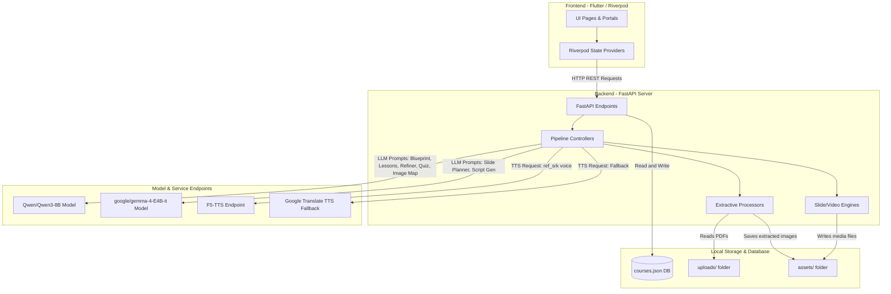

# Learning Management System (LMS) Project Architecture & Data Flow

This document provides a highly detailed, beginner-friendly architecture description, data flow analysis, and structural diagrams of the LMS document processing and generation pipeline. It is designed to explain the entire system's inputs, outputs, processes, and implementation logic down to every single step.

---

## 1. System Architecture Overview

The system is composed of:
1. **Frontend (Flutter / Riverpod)**: The client application that handles UI interactions, presentation renders, and API communication.
2. **Backend (FastAPI Server)**: The orchestration layer exposing REST APIs and managing controllers for extraction, planning, and compilation.
3. **Local Storage & Database**: A local JSON file-based database (`courses.json`) and standard filesystem folders for uploaded files and compiled media.
4. **Model & Service Endpoints**: Large Language Models (LLM) and Text-to-Speech (TTS) engines running on remote GPU hosts.

The diagram below shows how these components interact:

---

## 2. End-to-End Data Pipeline Flow

The chart below follows the sequential flow of data, starting from when a PDF is uploaded by a user and ending when a final MP4 course video is compiled:

```mermaid
flowchart TD
    start([Start: User Uploads PDF]) --> upload[Upload PDF to Backend]
    upload --> save_pdf[Save PDF to uploads folder]
    
    subgraph Step1 [Step 1: Course Blueprint Generation]
        save_pdf --> extract_text[Extract text & metadata with pdfplumber]
        extract_text --> normalise_text[Normalise sentences & Number lines]
        normalise_text --> llm_blueprint[Call Qwen LLM for segmentation: 3-6 modules]
        llm_blueprint --> align_headers[Adjust start_lines backward to catch headers]
        align_headers --> extract_imgs[Extract images & captions with PyMuPDF]
        extract_imgs --> assign_imgs[Map images to modules by line number/page]
        assign_imgs --> save_outline[Write course outline to courses.json]
    end

    subgraph Step2 [Step 2: Lessons, Refinement & Image Mapping]
        save_outline --> lesson_loop_start{Loop through Modules}
        lesson_loop_start -->|Module i| llm_lessons[Call Qwen LLM for Lessons + Bullets]
        llm_lessons --> clamp_bullets[Clamp long bullets & Number lessons]
        clamp_bullets --> feed_prior[Feed generated lesson titles as anchor for Module i+1]
        feed_prior --> lesson_loop_next{All Modules processed?}
        lesson_loop_next -->|No| lesson_loop_start
        lesson_loop_next -->|Yes| refine_bullets[Call Qwen LLM for Holistic Bullet Refinement]
        refine_bullets --> merge_bullets[Merge refined bullets back positionally]
        merge_bullets --> llm_img_map[Call Qwen LLM for Semantic Image-to-Bullet Mapping]
        llm_img_map --> save_lessons[Update courses.json]
    end

    subgraph Step3 [Step 3: MCQ Quiz Generation]
        save_lessons --> quiz_loop_start{Loop through Modules}
        quiz_loop_start -->|If num_questions positive| llm_quiz[Call Qwen LLM for MCQ Questions]
        llm_quiz --> save_quiz[Save quiz structure to courses.json]
        save_quiz --> quiz_loop_next{All Modules processed?}
        quiz_loop_next -->|No| quiz_loop_start
        quiz_loop_next -->|Yes| end_step3([Quizzes saved])
    end

    subgraph Step4 [Step 4: Slide Planning & HTML Compilation]
        end_step3 --> slide_loop_start{Loop through Modules}
        slide_loop_start -->|Module i| llm_slides[Call Gemma LLM for Slide Layout Types]
        llm_slides --> map_topics[Map slide parent topics by bullet text overlap]
        map_topics --> map_slide_imgs[Map slide images by bullet text/caption overlap]
        map_slide_imgs --> compile_html_slides[Compile static HTML slideshow file]
        compile_html_slides --> slide_loop_next{All Modules processed?}
        slide_loop_next -->|No| slide_loop_start
        slide_loop_next -->|Yes| end_step4([HTML slideshows compiled])
    end

    subgraph Step5 [Step 5: Narration Scripts & TTS Speech Synthesis]
        end_step4 --> script_loop_start{Loop through Modules}
        script_loop_start -->|Module i| llm_scripts[Call Gemma LLM for narration script]
        llm_scripts --> accumulate_script[Accumulate script for Module i+1 continuity]
        accumulate_script --> tts_loop_start{Loop through Slides}
        tts_loop_start -->|Slide j| clean_script[Clean text for TTS engine]
        clean_script --> call_tts[Call F5-TTS or Fallback Google TTS]
        call_tts --> save_wav[Save slide audio file]
        save_wav --> tts_loop_next{All Slides processed?}
        tts_loop_next -->|No| tts_loop_start
        tts_loop_next -->|Yes| script_loop_next{All Modules processed?}
        script_loop_next -->|No| script_loop_start
        script_loop_next -->|Yes| compile_html_slides_narr[Re-compile HTML slides with audio paths]
    end

    subgraph Step6 [Step 6: Video Compilation]
        compile_html_slides_narr --> render_png[Render slide frames to 1920x1080 PNGs via Pillow]
        render_png --> ffmpeg_encode[Encode PNG + WAV into individual slide MP4s via FFmpeg]
        ffmpeg_encode --> ffmpeg_concat[Concatenate slide MP4s into final module video MP4]
        ffmpeg_concat --> save_video_path[Save video_path in courses.json]
    end

    save_video_path --> finish([End: Course Fully Generated])
```

---

## 3. Step-by-Step Pipeline Details

This section describes every stage of the document processing pipeline, listing the files involved, inputs, outputs, processes, and implementation logic.

### Step 0: Document Upload
*   **Goal**: Securely capture a PDF document from the Flutter UI and save it locally on the server filesystem.
*   **Inputs**: Multipart Form Data containing a single `.pdf` file.
*   **Outputs**:
    *   File saved at `backend/uploads/{filename}`.
    *   JSON confirmation payload: `{"filename": "Test_Doc_2.pdf", "message": "File uploaded successfully"}`.
*   **Code & Implementation Details**:
    *   **File**: [main.py](file:///c:/Users/LPUSER/Desktop/LMS/backend/main.py#L34-L49)
    *   **Function**: [upload_file](file:///c:/Users/LPUSER/Desktop/LMS/backend/main.py#L35)
    *   **Process**: The endpoint validates that the file has a lowercased `.pdf` suffix. If it does not, an HTTP 400 Bad Request error is returned. If valid, the file stream is copied into `backend/uploads/` using `shutil.copyfileobj`.

---

### Step 1: Course Blueprint Generation (Outline)
*   **Goal**: Parse the uploaded PDF, extract document metadata, extract all embedded images and captions, segment the body text into a list of 3 to 6 logical course modules, and map images to those modules.
*   **Inputs**: PDF filename string.
*   **Outputs**:
    *   A primary course record written to `backend/courses.json`.
    *   Extracted images written to `backend/assets/images/{course_id}/`.
*   **Code & Implementation Details**:
    *   **Files**:
        *   [run_pipeline.py](file:///c:/Users/LPUSER/Desktop/LMS/backend/pipelines/run_pipeline.py#L17-L53) (`generate_course_outline()`)
        *   [blueprint_extractor.py](file:///c:/Users/LPUSER/Desktop/LMS/backend/pipelines/blueprint_extractor.py#L527-L627) (`run_blueprint_extraction()`)
        *   [image_extractor.py](file:///c:/Users/LPUSER/Desktop/LMS/backend/pipelines/image_extractor.py#L7-L126) (`extract_images_from_pdf()`)
    *   **Process Flow**:
        1.  **Text Extraction**: The system uses `pdfplumber` to read raw page text.
        2.  **Metadata Extraction**: It checks the first page of the PDF for a metadata table using `page.find_tables()`. If it exists, it parses key-value rows matching `Course Name`, `Course Description`, `Course Objective`, `Course Difficulty`, `Language`, `Target Audience`, and `Course Type`. If no tables are found, it falls back to a regular expression parser (`extract_metadata_programmatically`).
        3.  **Sentence Normalisation**: Double-newlines are temporarily preserved, soft-hyphens are re-joined (e.g. `word-\nword` to `wordword`), whitespace is collapsed, and the body text is divided into sentence-level lines using regex punctuation splits (`.`, `!`, `?`).
        4.  **Line Numbering**: The system prefixes every content line with a distinct tag (e.g. `[LINE 24] This is sentence text.`).
        5.  **Module Segmentation (LLM Call)**: The first 50,000 characters of numbered lines are sent to the Qwen LLM (`Qwen/Qwen3-8B`) at the Qwen endpoint. The model returns a structured JSON list conforming to `ModuleListSchema`, specifying the `title` and starting line number (`start_line` as an integer) for each of the 3-6 modules.
        6.  **Header Alignment**: To prevent section titles from being split from their body content, the code scans backward up to 5 lines from the LLM-returned start line. If it detects a matching title tag, step number, or ROMAN numeral indicator, it adjusts the `start_line` backward to capture the header.
        7.  **Text Slicing**: Slices the original text lines array using the adjusted start lines. Module $N$ represents lines $start\_line_N$ through $start\_line_{N+1} - 1$.
        8.  **Image Extraction**: PyMuPDF (`fitz`) opens the document, extracting embedded images along with coordinates (`bbox`). Captions are resolved by checking the closest text block below the image. If the image sits at the bottom of the page, the top text block of the next page is used as a fallback.
        9.  **Image-to-Module Mapping**: Assigns extracted images to modules by comparing caption line numbers or page numbers. It inserts `[IMAGE: image_id]` tags into the module text and removes the original raw caption lines to avoid duplicated text.

---

### Step 2: Lessons, Refinement & Image Mapping
*   **Goal**: Extract 3 to 5 distinct lessons for each module, refine all bullet points for length and voice, and map images to specific bullet points.
*   **Inputs**: `course_id`.
*   **Outputs**: Sub-structures for lessons, bullets, and mapped images saved in `courses.json`.
*   **Code & Implementation Details**:
    *   **Files**:
        *   [lesson_extractor.py](file:///c:/Users/LPUSER/Desktop/LMS/backend/pipelines/lesson_extractor.py#L71-L197) (`extract_lessons_for_module()`)
        *   [bullet_refiner.py](file:///c:/Users/LPUSER/Desktop/LMS/backend/pipelines/bullet_refiner.py#L73-L167) (`refine_bullets_inplace()`)
        *   [image_mapper.py](file:///c:/Users/LPUSER/Desktop/LMS/backend/pipelines/image_mapper.py#L15-L122) (`map_images_to_lessons()`)
    *   **Process Flow**:
        1.  **Lesson Extraction (Module Loop)**:
            *   Loops through modules sequentially.
            *   Forms a prompt containing the module title, module text, and all lesson titles generated in previous modules.
            *   Calls Qwen LLM using the `LESSON_EXTRACTION_PROMPT`. The previous lesson titles act as a style anchor, forcing the model to write consistent, outcome-focused titles and fact-based bullets.
            *   Post-processes the response to clamp long bullets (>25 words) to 20 words and number lessons sequentially.
        2.  **Holistic Bullet Refinement (Single Call)**:
            *   Aggregates all module lessons and bullets across the course.
            *   Calls Qwen LLM using `BULLET_REFINEMENT_PROMPT`. The model rephrases, consolidates, or splits bullets to achieve a standard length (~7 words) and unified author voice.
        3.  **Image-to-Lesson Mapping (Semantic Loop)**:
            *   Loops through modules. If a module has images, it passes their details and refined bullets to Qwen LLM using `IMAGE_LESSON_MAPPING_PROMPT`.
            *   Maps image IDs to specific bullet indices. If any image remains unmapped, it maps it to Lesson 1 as a fallback.

---

### Step 3: MCQ Quiz Generation
*   **Goal**: Generate multiple-choice questions for each module to test comprehension based on the course difficulty.
*   **Inputs**: `course_id`, `num_questions` per module.
*   **Outputs**: Quiz arrays containing questions, options, correct answers, and explanations saved in `courses.json`.
*   **Code & Implementation Details**:
    *   **File**: [quiz_generator.py](file:///c:/Users/LPUSER/Desktop/LMS/backend/pipelines/quiz_generator.py#L32-L128)
    *   **Function**: [generate_quiz_for_course](file:///c:/Users/LPUSER/Desktop/LMS/backend/pipelines/quiz_generator.py#L32)
    *   **Process Flow**:
        *   Loops through modules. If `num_questions` is greater than 0, it calls Qwen LLM with `QUIZ_GENERATION_PROMPT`.
        *   Supplies the course difficulty (Easy, Medium, Hard) and the module text content.
        *   Qwen generates exactly `num_questions` MCQs, each with options A, B, C, D, the correct key, and a detailed explanation of why the correct option is right and the others are wrong.

---

### Step 4: Slide Deck Planning & HTML Slideshow Compilation
*   **Goal**: Organize lesson bullet points into structured slide schemas and compile them into static HTML slideshow files.
*   **Inputs**: `course_id`.
*   **Outputs**:
    *   Slide structures saved in `courses.json`.
    *   HTML presentations written to `backend/assets/slides/{course_id}/module_{module_num}.html`.
*   **Code & Implementation Details**:
    *   **Files**:
        *   [slide_planner.py](file:///c:/Users/LPUSER/Desktop/LMS/backend/pipelines/slide_planner.py#L66-L278) (`plan_slides_for_module()`)
        *   [slides_generator.py](file:///c:/Users/LPUSER/Desktop/LMS/backend/pipelines/slides_generator.py#L7-L316) (`generate_html_slides_for_module()`)
    *   **Process Flow**:
        1.  **Slide Planning (LLM Call)**:
            *   Loops through modules. Calls the Gemma LLM (`google/gemma-4-E4B-it`) using `SLIDE_PLANNER_PROMPT`.
            *   Structures lesson bullets into visual templates:
                *   `concept`: Renders a term, formal definition, and key takeaways banner. The slide title is hidden in this layout.
                *   `steps`: Renders a horizontal, sequential timeline card row.
                *   `comparison`: Renders left-column and right-column point lists.
                *   `grid`: Renders a grid of 3 to 4 category cards.
                *   `bullets`: Renders a standard vertical bullet list.
        2.  **Topic & Image Mapping**:
            *   Fuzzy-maps slides to parent lesson topics based on text overlap with lesson bullet lists.
            *   Maps image IDs to slides based on word overlap scores with the slide text contents.
        3.  **HTML Slideshow Compilation**:
            *   Compiles the planned slide schemas into a responsive HTML presentation using a global stylesheet (`slides.css`).
            *   Integrates the **PhillipCapital Design System**:
                *   Applies Barlow typography (Arial fallback).
                *   Renders custom containers (e.g. timelines, card columns).
                *   Embeds custom Javascript controls (keyboard arrows, space bar listeners) and a `postMessage` event sender to sync slide index states with the Flutter container.
                *   If images are mapped, they are shown in a `.visual-area` side column. They are placed in a container that applies the P-shape geometry mask (top-right and bottom-left rounded, top-left and bottom-right sharp) with bottom-left overlay captions.

---

### Step 5: Narration Scripts & TTS Speech Synthesis
*   **Goal**: Create spoken speaker notes for each slide and synthesize them into high-quality narration WAV files.
*   **Inputs**: `course_id`.
*   **Outputs**:
    *   Slide narration scripts updated in `courses.json`.
    *   Audio WAV files saved at `backend/assets/audio/course_{course_id}/module_{module_num}/slide_{slide_num}.wav`.
    *   Re-compiled HTML presentation files embedding absolute audio URLs.
*   **Code & Implementation Details**:
    *   **Files**:
        *   [run_pipeline.py](file:///c:/Users/LPUSER/Desktop/LMS/backend/pipelines/run_pipeline.py#L143-L221) (`generate_scripts_for_course()`)
        *   [script_generator.py](file:///c:/Users/LPUSER/Desktop/LMS/backend/pipelines/script_generator.py#L236-L295) (`generate_scripts_for_module()`, `synthesize_speech_for_slide()`)
    *   **Process Flow**:
        1.  **Narration Script Generation (LLM Call)**:
            *   Loops through modules. Sends raw module text, slide layout structures, and the accumulated narration script from the previous module.
            *   Calls Gemma LLM using `SCRIPT_GENERATION_PROMPT`. The model uses previous scripts as a transition anchor to generate a continuous first-person spoken script (40-100 words per slide).
        2.  **Text-to-Speech Synthesis**:
            *   Loops through slides. Cleans XML/HTML tags and expands shorthand terms (e.g. "Ltd." to "Limited", "Rs" to "Rupees").
            *   Calls F5-TTS endpoint with the voice profile (default `ref_srk` male narrator), reference audio (`ref_srk.wav`), and its reference transcript.
            *   **Fallback**: If the GPU server is offline or errors, the script splits text into <200 character chunks, queries Google Translate TTS, and joins the synthesized WAV files.
        3.  **Slide Re-compilation**: Re-compiles the slideshow HTML files to insert absolute audio URLs and synchronized speaker notes.

---

### Step 6: Video Compilation
*   **Goal**: Render slide layouts as PNG frames, combine them with WAV audio files, and concatenate them into a final MP4 video module.
*   **Inputs**: `course_id`, module number, slides, audio files.
*   **Outputs**: Final compiled module MP4 video file written to `backend/assets/videos/course_{course_id}/module_{module_num}.mp4`.
*   **Code & Implementation Details**:
    *   **File**: [video_generator.py](file:///c:/Users/LPUSER/Desktop/LMS/backend/pipelines/video_generator.py#L402-L525)
    *   **Function**: [generate_video_for_module](file:///c:/Users/LPUSER/Desktop/LMS/backend/pipelines/video_generator.py#L402)
    *   **Process Flow**:
        1.  **Pillow Frame Rendering (Slide Loop)**:
            *   Creates a blank 1920x1080 canvas.
            *   Draws the corporate logo or wordmark.
            *   Renders visual elements matching the slide's layout (`concept`, `steps`, `comparison`, `grid`, `bullets`) using standard fonts (Arial Bold/Regular fallbacks).
            *   Applies **PhillipCapital styling**:
                *   Uses primary blue (`#00317A`) and brand accents.
                *   In `concept` layout, draws a cyan vertical block, the core term, definition, and a gray box with a blue left border for takeaways. Slide title headers are hidden.
                *   If images are mapped, they are scaled and rounded using a custom corner mask (top-right and bottom-left rounded, top-left and bottom-right sharp) with an overlaid translucent blue caption banner on the lower-left side.
            *   Saves as `slide_{idx}.png`.
        2.  **FFmpeg Slide-Clip Encoding (Slide Loop)**:
            *   Queries `imageio-ffmpeg` to determine the slide's audio duration. If audio is missing, it sets a 5.0-second default and generates a silent mono audio stream.
            *   Runs FFmpeg to encode the PNG frame and WAV audio into `clip_{idx}.mp4` using `libx264` and `aac`.
        3.  **FFmpeg Concatenation**:
            *   Writes all clip paths to `concat.txt`.
            *   Runs FFmpeg's `concat` demuxer to merge slide clips together without re-encoding, preserving CPU resources.
            *   Updates `video_path` in `courses.json`.

---

## 4. Analysis of Parallelism and Loops

### Sequential Execution Constraints
> [!IMPORTANT]
> **There is NO parallel execution in this backend pipeline.**
> All tasks are handled strictly in a serial, sequential manner.

This sequential architecture is mandatory due to critical design constraints:
1.  **Context/Style Anchoring**: Step 2 (Lesson Extraction) relies on having access to *all* lesson titles generated in prior modules to prevent stylistic drift.
2.  **Transition Continuity**: Step 5 (Script Generation) requires the narration scripts of the previous module (`previous_script`) to generate logical transition sentences.
3.  **Hardware Resource Constraints**: Large Language Models (vLLM) and Text-to-Speech synthesis (GPU F5-TTS) are highly compute-intensive. Running queries in parallel would overload GPU endpoints, resulting in timeout failures (FastAPI timeout limit is 600s).
4.  **Data Race Prevention**: The file-based JSON database (`courses.json`) is shared. Sequential writes prevent concurrent processes from overwriting each other's changes.

### Loop Structures in Code
The pipeline implements the following distinct loop iterations:

| Pipeline Step | Loop Type | Iteration Level | Purpose / Operation |
| :--- | :--- | :--- | :--- |
| **Step 1 (Blueprint)** | Sequential | PDF Pages | Extract text and detect tables. |
| | Sequential | PDF Images | Extract coordinates, pages, and captions using PyMuPDF. |
| **Step 2 (Lessons)** | Sequential | Modules | Call LLM to extract lessons while passing prior titles as context. |
| | Sequential | Modules | Run semantic matching to assign images to bullets. |
| **Step 3 (Quizzes)** | Sequential | Modules | Call LLM to generate MCQs if `num_questions > 0`. |
| **Step 4 (Slides)** | Sequential | Modules | Call LLM to plan layouts and output structured visual elements. |
| **Step 5 (Scripts/TTS)** | Sequential | Modules | Call LLM for slide script narration using transition context. |
| | Sequential | Slides (inner) | Clean text and call TTS API to generate `.wav` narration files. |
| **Step 6 (Video)** | Sequential | Slides | Render frames via Pillow; run FFmpeg to encode still PNG + WAV audio. |

---

## 5. Design Compliance & Styling Systems

All generated visual assets (static HTML slides and compiled MP4 video frames) are compiled using the **PhillipCapital Design System**:

*   **Color Palette**: Primary Blue (`#00317A`), Secondary Light Gray (`#EEEEEE`), Gray (`#AAAAAA`), Accent Cyan (`#17BCE2`), Orange (`#F78F20`), Green (`#14C496`), and Red (`#FF1515`).
*   **Typography**: *Barlow* is used for body content and list items. *Inter* is reserved for main headers and logos.
*   **UI Geometry ("P" shape)**: Image frames use asymmetric corner rounding. The top-right and bottom-left corners are rounded (radius 32), while the top-left and bottom-right corners remain sharp. Captions are overlaid on the lower-left angular side of the frame in a semi-transparent blue banner.
*   **Logo Rules**: The full "PhillipCapital" wordmark is always utilized. The isolated "P" letter is prohibited in accordance with brand rules.

---

## 6. Execution Call Count Reference

To help estimate compute requirements, here is the breakdown of API calls made for a course containing $M$ modules and $S$ total slides across all modules:

### Large Language Model (LLM) Calls

| Step | Operation | Target Model | API Calls |
| :--- | :--- | :--- | :--- |
| **Step 1** | Blueprint (Segmentation) | **Qwen3-8B** | $1$ call |
| **Step 2** | Lesson Extraction | **Qwen3-8B** | $M$ calls (1 per module) |
| **Step 2** | Bullet Refinement | **Qwen3-8B** | $1$ call (holistic course pass) |
| **Step 2** | Image Mapping | **Qwen3-8B** | $M_{img}$ calls (1 per module containing images) |
| **Step 3** | Quiz Generation | **Qwen3-8B** | $M_{quiz}$ calls (1 per module where `num_questions > 0`) |
| **Step 4** | Slide Planning | **Gemma-4** | $M$ calls (1 per module) |
| **Step 5** | Script Generation | **Gemma-4** | $M$ calls (1 per module) |

#### Call Counts Formula Summary:
*   **Total LLM Calls**: $2 + 3M + M_{img} + M_{quiz}$ (maximum of $2 + 5M$ calls if all modules contain images and quiz questions)
*   **Qwen Calls**: $2 + M + M_{img} + M_{quiz}$
*   **Gemma Calls**: $2M$

### Text-To-Speech (TTS) Calls

| Step | Operation | Target Engine | API Calls |
| :--- | :--- | :--- | :--- |
| **Step 5** | Speech Synthesis | **F5-TTS** (or fallback Google TTS) | $S$ calls (1 call per slide) |

#### Call Counts Formula Summary:
*   **Total TTS Calls**: $S$ calls
